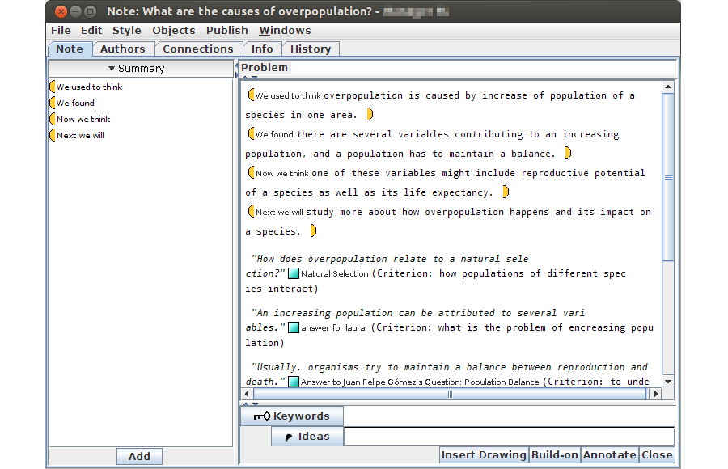
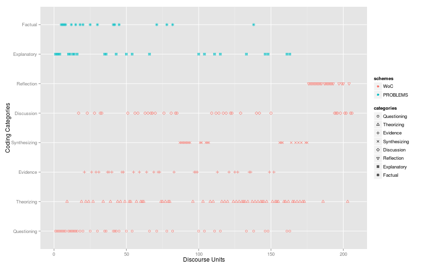

## Knowledge Building and science learning

1. A **theory-building** approach for deep understanding
 - "knowledge-as-theories" (Carey, 1985; Posner, et al., 1982)
 - "mental models" (Vosniadou & Brewer, 1992)
 - improvement towards higher "explanatory power" (Bereiter, 2012)
2. A **community-oriented** view of learning
 - individual minds → individual + social aspects (Vosniadou, 2008)
 - schools as knowledge-creating organizations
 - ideas as "epistemic artifacts" to be continually improved
 
<!--in which the state of knowledge is more determined by the community rather than individuals-->

---

## Promisingness judgments in knowledge creation

- **Design-mode vs. belief-mode thinking** (Bereiter, 2002)
  - `promisingness` vs. truthfulness
- Paradigm shift and theory choice (Kuhn, 1977, 1996)
- Risk assessment in real-world scientific reasoning (Dunbar, 1995)
- Detecting "discrepant elements" in creative processes (Gardner, 1994)
- Knowledge of **promisingness** distinguishes creative experts from non-experts (Bereiter & Scardamalia, 1993)

--- #blockquote

 

> During all those years there was the **feeling of direction**, of going straight toward something concrete. It is, of course, very hard to express that feeling in words; but it was **decidedly the case**, and clearly to be distinguished from later considerations about the rational form of the solution. 
>
> — Albert Einstein, Nobel laureate in physics, 1921

---

 

> I think, we almost felt at times that there was **almost a hand guiding us**. Because we would go from one step to the next, and somehow we would **know which was the right way to go**. 
>
> — Michael S. Brown, Nobel laureate in medicine, 1985

---

## Promisingness judgments in KB classrooms

- Students facing the same challenge of identifying promising directions
- An important component of students' epistemic agency
- Prior research on promisingness
  1. Promising Ideas (PI) tool in Knowledge Forum (Chen et al., 2010)
  2. The term promisingness is naturally challenging (Chen et al., 2011)
  3. But, with guidance, students could make promisingness judgments leading to greater knowledge advancement (Chen et al., 2012)

--- .shout #next

## Next steps?

---

 
> `Science is about failure`... Everyone makes mistakes and scientists especially. Because they’re going to try something and it's not always going to work... So science isn't about learning what other people have learned. Science is about finding things out for yourself... It's kind of like ... trial and error. So you're going to learn lots about it, but sometimes you're not going to get the right one.  — A Grade 5 student, during an interview at ICS

---

## Epistemic beliefs in science learning

- "*Beliefs about the nature of knowledge*" (Schommer, 1990)
- **Multiple dimensions** (Conley, Pintrich, Vekiri, & Harrison, 2004)
  1. *certainty of knowledge*
  2. *simplicity of knowledge*
  3. *source of knowing*
  4. *justification for knowing*
- **Promisingness judgments ↔ Epistemic beliefs**

<!--
## Promisingness judgments ↔ Epistemic beliefs

- Quality promisingness judgments depends on epistemic beliefs
  - knowledge is an evolving subject ↔ "certainty of knowledge"
  - ideas are complex ↔ "simplicity of knowledge"
  - ideas are tentative ↔ "justification for knowing"
- By engaging students in making promisingness judgments, whether their epistemic beliefs could be improved?
  - which dimensions are easier to be advanced?
-->

---

## Methods

- 26 Grade 6 students from a Colombian K-12 school
- Studying a biology unit, "population dymanics", for 10 weeks

<!--
Phase    | Time      | Activities
---------|-----------|----------------------------
Phase 1  | Week 1-4  | Pre-test
         |           | Pedagogical intervention
Phase 2  | Week 5-7  | KB + PJ
Phase 3  | Week 8-10 | KB + PJ
-->

---

## Promising Ideas tool

--- .cover .w

--- .cover

---

## An overview of results

---

## I. Evolution of students' promisingness knowledge

- **True ideas**

> *"It is true. You have the observation that is true."*

> *"It depends on the person who write the answer because ... if the answer is answered by a scientist, the answer can be more accurate."*

> *"We think promising idea is like a possible answer. It probably can be correct."*

---

- **Pointing to true ideas**

> *"I don't think it's absolutely correct because ... we don't think promising means absolutely correct but near correct."*

> *"I disagree with ... I think that's not necessary an expert can make a promising answer. ... Because the promising question takes time, not like a question you're doing in a second."*

---

- **Fruitfulness**

> *"I think what makes ideas promising is ... it produces interests of further investigation or discussion..."*

> *"A promising idea is not the answer, it is the idea that lead you to discussion. As we said before, they are not necessarily the correct answer, but those topics can lead you to discuss and be engaged, and learn a little bit about that topic."*

---

## II. Impact of PJ on discourse patterns

<!--
--- .cover

-->

---

## III. Conceptual advancement in population dynamics

1. Conceptual quiz
  - significant improvement, *t*(24) = -5.75, *p* < .001
2. Scientificness
  - significant improvment from Phase 1 to 2, *t*(44) = -2.02, *p* < .05
  - from *M* = 2.12 (*SD* = 0.85) to *M* = 2.65 (*SD* = 0.93)
3. Epistemic complexity
  - nonsignificant, *t*(44) = -0.68, *n.s.*
  - naturally harder to improve for younger students

---

## IV. Changes in students' epistemic beliefs

- epistemic growth ↔ promisingness conception growth, *r* = .47, *p* < .05
- epistemic growth ↔ conceptual understanding, *r* = .46, *p* < .01

---

## Conclusions

- Students' initial understanding of promisingness could be advanced
- Promisingness judgments had an impact on discourse patterns
- By refocusing discourse on promising ideas, scientific understanding was advanced across phases
- Students' epistemic beliefs improved across phases, and appeared to co-develop with promisingness knowledge and conceptual understanding

--- .shout

## Gracias!

- [Link to slides](http://dirkchen.github.io/kbsi13-pi)
- bodongchen@utoronto.ca
